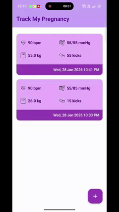

# 🤰 Pregnancy Vitals Tracker

An Android application built with Jetpack Compose to help expectant mothers track their vital health metrics throughout pregnancy. Features automated reminders, local data storage, and a clean Material Design 3 interface.

## 📱 Features

- **Vitals Logging** - Track blood pressure (systolic/diastolic), heart rate, weight, and baby kicks
- **Delete Entries** - Long-press any entry to delete with confirmation dialog
- **Automated Reminders** - Get notified every 5 hours to log vitals using WorkManager
- **Local Storage** - All data stored securely using Room Database
- **Material Design 3** - Modern, intuitive UI with Jetpack Compose
- **Notification Actions** - Click notifications to open directly to logging screen
- **MVVM Architecture** - Clean, maintainable code structure

## Demo


## 🏗️ Architecture

This app follows **MVVM (Model-View-ViewModel)** architecture pattern:

```
┌─────────────────────────────────────────────────────────┐
│                         View Layer                       │
│  (Jetpack Compose UI - EntriesScreen, Dialogs, etc.)   │
└────────────────────┬────────────────────────────────────┘
                     │
┌────────────────────▼────────────────────────────────────┐
│                    ViewModel Layer                       │
│     (EntriesViewModel, NotificationViewModel)           │
└────────────────────┬────────────────────────────────────┘
                     │
┌────────────────────▼────────────────────────────────────┐
│                   Repository Layer                       │
│  (EntriesRepository, NotificationRepository)            │
└────────────────────┬────────────────────────────────────┘
                     │
┌────────────────────▼────────────────────────────────────┐
│                     Data Sources                         │
│        (Room Database, WorkManager)                      │
└─────────────────────────────────────────────────────────┘
```

## 📂 Project Structure

```
app/src/main/java/com/hariom/pregnancy/
├── Entries_model/
│   ├── AppDatabase.kt              # Room database configuration
│   ├── Entries.kt                  # Vitals data entity
│   ├── Entries_Dao.kt              # Database access object
│   └── EntriesRepository.kt        # Data repository
│
├── Entries_viewModel/
│   └── EntriesViewModel.kt         # ViewModel for vitals management
│
├── notification/
│   ├── VitalsReminderWorker.kt     # WorkManager worker for reminders
│   ├── NotificationRepository.kt   # Notification scheduling logic
│   ├── NotificationViewModel.kt    # ViewModel for reminder settings
│   └── NotificationHelper.kt       # Utility functions
│
├── View/
│   ├── MainActivity.kt             # Main activity entry point
│   └── UI_module/
│       ├── EntriesScreen.kt        # Main vitals list screen
│       ├── AddEntriesDialog.kt     # Dialog for adding vitals
│       ├── EntriesItem.kt          # List item component with long-press
│       ├── DeleteConfirmationDialog.kt # Delete confirmation dialog
│       └── ReminderSettingsScreen.kt # Reminder toggle settings
│
└── ui/
    └── theme/                      # Material Design 3 theme
```

## 🚀 Getting Started

### Prerequisites

- Android Studio Hedgehog (2023.1.1) or later
- JDK 11 or higher
- Android SDK 24+ (Android 7.0+)
- Gradle 8.0+

### Installation

1. **Clone the repository**
   ```bash
   git clone https://github.com/yourusername/pregnancy-tracker.git
   cd pregnancy-tracker
   ```

2. **Open in Android Studio**
   - Open Android Studio
   - Select "Open an Existing Project"
   - Navigate to the cloned directory

3. **Sync Gradle**
   - Android Studio will automatically prompt to sync
   - Or manually: File → Sync Project with Gradle Files

4. **Run the app**
   - Connect an Android device or start an emulator
   - Click the "Run" button or press Shift+F10

## 🔧 Configuration

### Notification Reminder Interval

To change the reminder frequency, edit `NotificationRepository.kt`:

```kotlin
val workRequest = PeriodicWorkRequestBuilder<VitalsReminderWorker>(
    5, TimeUnit.HOURS  // Change this value
).build()
```

Available options: `MINUTES`, `HOURS`, `DAYS` (minimum 15 minutes for PeriodicWork)

### Notification Content

Customize notification text in `VitalsReminderWorker.kt`:

```kotlin
.setContentTitle("Time to log your vitals!")
.setContentText("Stay on top of your health. Please update your vitals now!")
```

### Database Configuration

Database settings in `AppDatabase.kt`:

```kotlin
@Database(entities = [Entries::class], version = 1, exportSchema = false)
```

## 📦 Dependencies

### Core Libraries
- **Jetpack Compose** - Modern declarative UI toolkit
- **Material Design 3** - Latest Material Design components
- **Room Database** - Local data persistence
- **WorkManager** - Background task scheduling
- **Kotlin Coroutines** - Asynchronous programming
- **LiveData** - Lifecycle-aware observable data

### Version Catalog (libs.versions.toml)
```toml
[versions]
kotlin = "2.3.0"
compose-bom = "2024.09.00"
room = "2.8.4"
workManager = "2.10.0"
```

## 🔔 Notification System

### How It Works

1. **Automatic Scheduling** - Reminders start when app launches
2. **Persistent** - Survives app restarts and device reboots
3. **Permission Handling** - Requests notification permission on Android 13+
4. **Click Action** - Opens app directly to logging screen

### Notification Details

- **Title**: "Time to log your vitals!"
- **Message**: "Stay on top of your health. Please update your vitals now!"
- **Frequency**: Every 5 hours
- **Channel**: High priority for visibility

### Testing Notifications

For immediate testing, temporarily change the interval:

```kotlin
// In NotificationRepository.kt
PeriodicWorkRequestBuilder<VitalsReminderWorker>(
    15, TimeUnit.MINUTES  // Test with 15 minutes
)
```

Or trigger manually:
```kotlin
NotificationHelper.triggerTestNotification(context)
```

## 🗄️ Database Schema

### Entries Table

| Column | Type | Description |
|--------|------|-------------|
| id | Int (PK) | Auto-generated unique ID |
| systolic | Int | Systolic blood pressure (mmHg) |
| diastolic | Int | Diastolic blood pressure (mmHg) |
| heartRate | Int | Heart rate (bpm) |
| weight | Float | Weight (kg or lbs) |
| babyKicks | Int | Number of baby kicks |
| timestamp | Long | Unix timestamp of entry |

## 🎨 UI Components

### Main Screens

1. **EntriesScreen** - Displays list of all logged vitals with delete functionality
2. **AddEntriesDialog** - Modal dialog for adding new vitals
3. **DeleteConfirmationDialog** - Confirmation dialog for deleting entries
4. **ReminderSettingsScreen** - Toggle reminder on/off (optional)

### Theme

Custom Material Design 3 theme with pregnancy-focused color palette:
- Primary: Purple tones (#6B4C7A)
- Background: Light purple (#F5F0F8)
- Accent: Button purple for CTAs

## 🔐 Permissions

Required permissions in `AndroidManifest.xml`:

```xml
<uses-permission android:name="android.permission.POST_NOTIFICATIONS" />
<uses-permission android:name="android.permission.SCHEDULE_EXACT_ALARM" />
```

- **POST_NOTIFICATIONS** - Required for Android 13+ to show notifications
- **SCHEDULE_EXACT_ALARM** - Optional, for precise scheduling

## 🧪 Testing

### Manual Testing Checklist

- [ ] Launch app and grant notification permission
- [ ] Add a new vitals entry
- [ ] Verify entry appears in list
- [ ] Long-press an entry to trigger delete dialog
- [ ] Test Cancel button - entry should remain
- [ ] Long-press again and confirm Delete - entry should be removed
- [ ] Wait for notification (or use test interval)
- [ ] Click notification and verify logging dialog opens
- [ ] Close and reopen app - verify data persists
- [ ] Toggle reminders on/off in settings

### Debug Commands

Check WorkManager status:
```bash
adb shell dumpsys jobscheduler | grep VitalsReminder
```

View app notifications:
```bash
adb shell dumpsys notification
```

## 🐛 Troubleshooting

### Notifications Not Showing

1. Check notification permission is granted
2. Verify notification channel is created
3. Check battery optimization settings
4. Review Logcat for WorkManager errors

### Database Issues

1. Clear app data: Settings → Apps → Pregnancy Tracker → Clear Data
2. Uninstall and reinstall app
3. Check Room schema version

### Build Errors

1. Clean project: Build → Clean Project
2. Invalidate caches: File → Invalidate Caches / Restart
3. Sync Gradle files
4. Update Android Studio to latest version

## 📱 Minimum Requirements

- **Min SDK**: 24 (Android 7.0 Nougat)
- **Target SDK**: 36
- **Compile SDK**: 36
- **JVM Target**: 11

## 🤝 Contributing

Contributions are welcome! Please follow these steps:

1. Fork the repository
2. Create a feature branch (`git checkout -b feature/AmazingFeature`)
3. Commit your changes (`git commit -m 'Add some AmazingFeature'`)
4. Push to the branch (`git push origin feature/AmazingFeature`)
5. Open a Pull Request

## 📄 License

This project is licensed under the MIT License - see the LICENSE file for details.

## 👨‍💻 Author

**Hariom**

## 🙏 Acknowledgments

- Jetpack Compose team for the amazing UI toolkit
- Material Design team for design guidelines
- Android WorkManager for reliable background scheduling
- Room Database for seamless local storage

## 📚 Additional Documentation

- [REMINDER_SYSTEM_GUIDE.md](REMINDER_SYSTEM_GUIDE.md) - Detailed reminder implementation guide
- [INTEGRATION_EXAMPLE.md](INTEGRATION_EXAMPLE.md) - Code examples for integration
- [REMINDER_SYSTEM_SUMMARY.md](REMINDER_SYSTEM_SUMMARY.md) - Quick reference summary

## 🔮 Future Enhancements

- [ ] Edit existing entries
- [ ] Data export to CSV/PDF
- [ ] Charts and graphs for vitals trends
- [ ] Multiple user profiles
- [ ] Cloud backup and sync
- [ ] Doctor appointment reminders
- [ ] Medication tracking
- [ ] Pregnancy week calculator
- [ ] Educational content and tips
- [ ] Swipe to delete gesture

---

**Made with ❤️ for expectant mothers**
